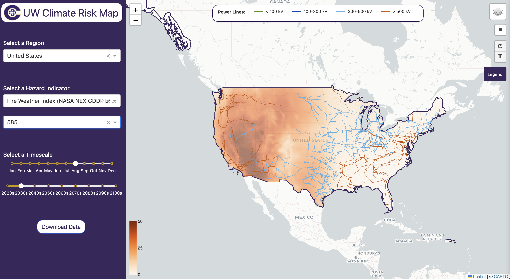

# UW Climate Risk Map

*Live app - 03-14-2025*

## Vision & Goals
The UW Climate Risk Map is an open-source mapping platform to support research, education, and policy in assessing the financial effects of climate change in the Pacific Northwest. 

Our goals are to:
1. Provide a dynamic map-based interface for exploring financial impacts of climate risks to the power grid

2. Serve as a teaching tool at universities, helping students and researchers analyze climate data

3. Allow external contributors to expand the data sources, models, and visualizations

Our current focus is on the risks to the power grid in Washington State. Over time we hope to expand the geographic and sector scope of the project. 

**The map is currently in active development as we work to expand its features, methodology, and usability.**

## Technical Architecture

The application consists of several key components:

### Application (`/application`)
- Dash application built with [Dash Leaflet](https://www.dash-leaflet.com/) for interactive mapping
- Docker containerized deployment
- Visualizes infrastructure and climate data layers
- [TiTiler](https://developmentseed.org/titiler/) used for serving climate raster overlay
- Database API nested in `/application/app/api`, can be deployed as a standalone API for user direct data access

### Data Processing Pipelines

#### Hazard

##### Wildfire
- **Fire Weather Index Pipeline** (`/data_processing/hazards/wildfire/fwi`)
  - Processes NASA NEX-GDDP-CMIP6 data
  - Computes FWI components using Dask and Xclim
  - Distributed computing with AWS Batch support
  - Zarr format output to S3

- **Burn Probability**
  - Uses USDA Wildfire Burn Probability to get grid level burn probabilties
  - Outputs data in Zarr by decade, using Fire Weather Index to scale

#### Exposure
- **Infrastructure & Climate Intersections** (`/data_processing/exposure/nasa_nex`)
    - Uses NASA NEX zarr as input
    - Performs spatial intersections with OpenStreetMap features
    - Parallel processing for zonal aggregation
    - PostGIS database loading

#### Geotiff
- **Geotiff Processing Component**
  - Takes Zarr path as input
  - Outputs Cloud Optimzied Geotiffs for serving on frontend application

### ETL Services

#### PGOSM Flex (`/data_processing/etl/pgosm_flex`)
- Infrastructure data ETL using pgosm-flex
- Docker-based pipeline for OSM data import
- Configurable for different regions and layer sets
- PostGIS database integration

### Database
- PostgreSQL with PostGIS extension
- Stores infrastructure and processed climate data
- Supports spatial queries and analysis
- Multiple user roles and access controls

### Cloud Infrastructure
- AWS-based deployment (Lambda, S3, Batch)
- TiTiler for serving Cloud Optimized GeoTIFFs
- Docker containers for processing and deployment
- Environment-based configuration management

### CI/CD Workflows
- GitHub Actions for automated testing and deployment
- Separate workflows for application and data processing components
- Automated testing with Poetry and pytest
- Docker image builds for containerized components
- Automated deployment to AWS infrastructure
- Security-focused deployment with dynamic IP whitelisting

## Technical Dependencies
- Python 3.11+ (3.12 for some components)
- PostgreSQL with PostGIS
- Docker and Docker Compose
- AWS Services (Lambda, S3, Batch)
- GDAL and GEOS for geospatial processing
